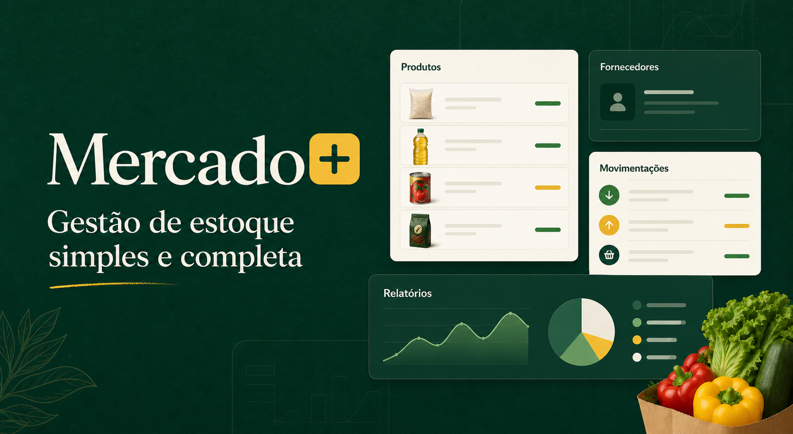

# Mercado+



Sistema web completo para gestão de mercados, reunindo controle de estoque, frente de caixa, fornecedores, funcionários, movimentações e relatórios em um único ambiente.

## Demonstração

### [Acessar o Mercado+](https://mercado-estoque-leo.leobsads12.chatgpt.site)

Clique em **Testar demonstração** para conhecer todas as funções sem precisar criar uma conta. Cada visitante recebe um ambiente isolado, com dados próprios e acesso temporário de duas horas.

> No primeiro acesso, o ambiente pode levar alguns instantes para preparar os dados.

## Principais funcionalidades

- Cadastro, edição, busca, ordenação e exclusão de produtos;
- Código de produto gerado automaticamente;
- Controle de estoque e avisos de estoque baixo;
- Cadastro de fornecedores com CPF/CNPJ, telefone e e-mail formatados;
- Exclusão conjunta de fornecedor e produtos vinculados, mediante confirmação;
- Frente de caixa com busca por nome, código e código de barras;
- Pagamentos em dinheiro, cartão e PIX;
- PIX manual com chave e QR Code configuráveis;
- Baixa automática do estoque após cada venda;
- Cancelamento da última venda com devolução dos itens ao estoque;
- Abertura e fechamento de caixa com conferência de valores;
- Histórico detalhado de vendas e movimentações;
- Relatórios de vendas diárias e mensais;
- Cadastro de funcionários e controle de permissões;
- Login com e-mail e senha ou conta Google;
- Recuperação de senha e aprovação de novos proprietários por e-mail;
- Modo claro e escuro;
- Layout responsivo para computador e celular;
- Instalação como aplicativo no computador ou celular.

## Segurança e organização

- Cada estabelecimento possui seus próprios produtos, fornecedores, vendas e funcionários;
- Senhas protegidas e sessões com tempo de validade;
- Permissões diferentes para administradores e operadores de caixa;
- Operações de venda realizadas de forma segura para evitar divergências no estoque;
- Proteção contra excesso de tentativas de acesso e cadastro;
- Demonstrações isoladas, temporárias e removidas automaticamente;
- Informações confidenciais mantidas fora do repositório.

## Tecnologias utilizadas

### Interface

- TypeScript;
- React;
- Next.js com Vinext;
- CSS responsivo;
- PWA.

### Servidor e dados

- Python;
- FastAPI;
- PostgreSQL;
- SQLAlchemy;
- Cloudflare D1 para contas e sessões.

### Serviços

- Google OAuth para acesso com Google;
- Resend para envio de e-mails;
- Render para o serviço de dados;
- Neon para o banco PostgreSQL;
- OpenAI Sites para publicação da interface.

## Regras importantes implementadas

Ao finalizar uma venda, o Mercado+ confirma a disponibilidade dos produtos, registra os itens e valores praticados, reduz o estoque, identifica o operador e salva toda a movimentação em conjunto. Caso alguma etapa falhe, a venda não é concluída pela metade.

O cancelamento realiza o processo inverso: registra o estorno, devolve as quantidades ao estoque e mantém o histórico para conferência.

## Qualidade

- Testes automáticos da interface e das regras do sistema;
- Testes de vendas, cancelamentos, estoque, permissões e fechamento de caixa;
- Verificação automática antes de cada publicação;
- Dependências de produção revisadas contra vulnerabilidades conhecidas.

## Executando localmente

### Requisitos

- Node.js 22 ou superior;
- Python 3.14;
- PostgreSQL.

### Instalação

```bash
git clone https://github.com/Siriius1/MercadoEstoque.git
cd MercadoEstoque
npm install
```

Crie os arquivos de configuração a partir de `.env.example` e `backend/.env.example`. Depois, no Windows, execute:

```text
INICIAR-MERCADO.cmd
```

O projeto estará disponível em `http://localhost:3000`.

Para encerrar, execute `PARAR-MERCADO.cmd`.

## Autor

Desenvolvido por **Leonardo Gomes Soares de Souza** — **Siirius**.

- [GitHub](https://github.com/Siriius1)
- [Demonstração online](https://mercado-estoque-leo.leobsads12.chatgpt.site)
